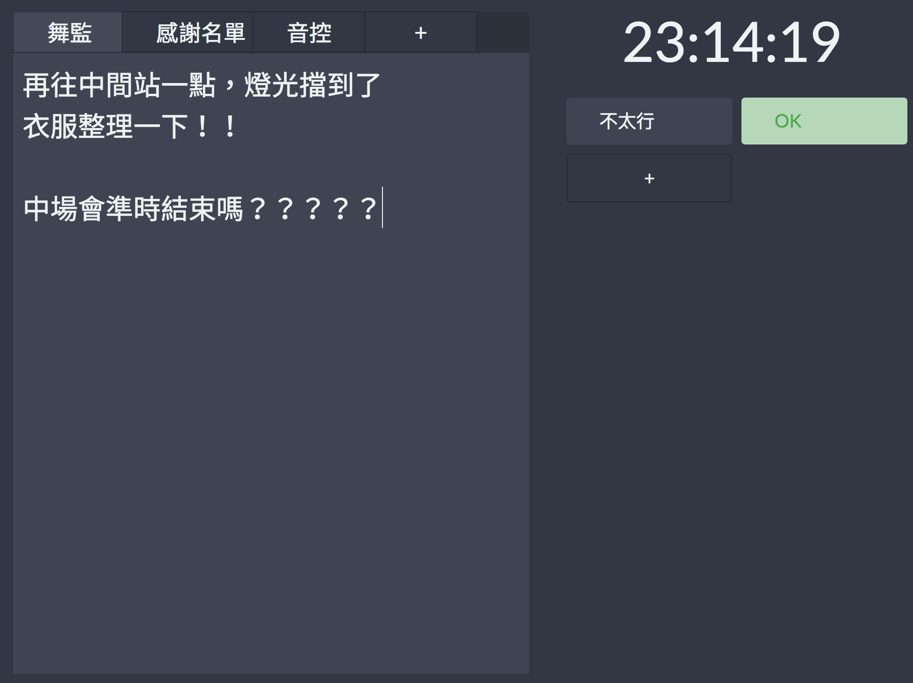
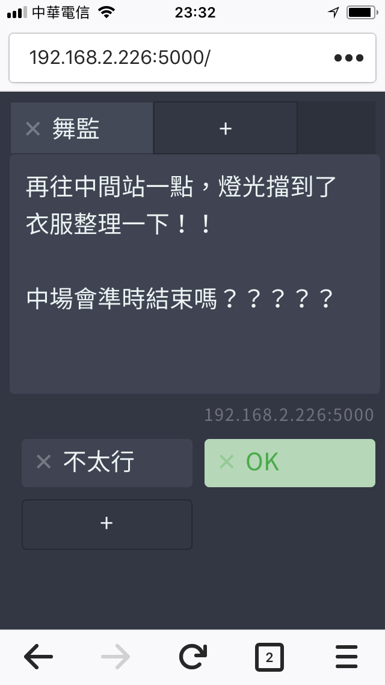

在舞台上，演奏者若臨時需要跟台下的舞台總監或是音控台溝通，簡直是有苦難言；台下若是有事情要提醒台上的演奏者，也只能依賴比手畫腳或是傳紙條，十分不便。

**舞台管理員**為一方便台上台下簡易溝通的工具，**所有連線裝置同步更新**。畫面分為三個區塊：

1. 時鐘
2. 文字頁面：替代傳紙條的功能。可以新增多個頁面，方便管理紙條主題。
3. 文字選項：可以新增選項，點擊後切換顏色，作為簡易的交互溝通工具。

# 環境設置

所有欲連線的裝置必須連接至同一個Wi-Fi路由器，並由電腦開啟伺服器。
# 安裝與使用

1. 下載專案至電腦，或是使用`git clone`工具。

        git clone https://github.com/aljohn0422/stage_manager.git
2. 開啟已編譯的程式。
    
    ### For Windows

    雙擊`stage_manager.exe`執行。

    ### For Mac

    使用Terminal終端機執行：

        # cd to project folder
        cd stage_manager
        ./stage_manager

    您應該會看到終端機顯示以下訊息，代表伺服器已順利開啟。

        2018/05/02 23:26:08 Open the link in browser: 192.168.2.226:5000
    開啟瀏覽器，進入指定連結即可進入網站。伺服器開啟成功後，所有已連線至同一個Wi-Fi路由器的裝置皆可由該連結進入。

# 功能
1. 所有連線裝置即時同步更新。
2. 使用者可以任意新增文字按鈕。
3. 使用者可以任意修改頁面資訊。
4. 支援電腦與手機介面。
<!-- {:width="120px"} -->
